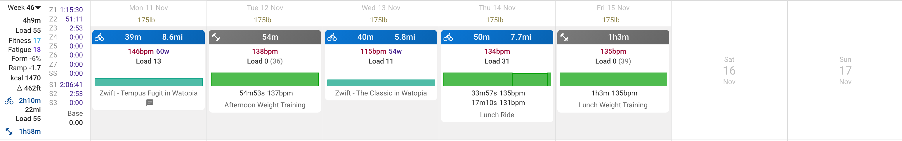

---

title: "Week 2 - Winter Arc"

date: 2024-11-18

description: "Santa, all I want is aero bars."

tags: [fitness]

---

Related: [Week 1 Winter Arc]()

## Week 2 overview
- Cycling - 3 sessions, 2h10m total
- Weight training - 2 sessions, 2h total

### Hip rehab

My hip has slightly improved since the last week, but it did flare up significantly on Saturday when I was walking around the nutcracker market. Right now, my rehab routine is fairly simple, and focused on strengthening the hip.

2 rounds, 8-15 reps at 7-8 RPE
1. Seated hip internal rotation with band
2. Standing hip flexion with band
3. Banded fire hydrant
4. Single leg bridge

Mobility work
1. 90/90
2. Figure 4
3. Knee to opposite chest

## Looking forward

I am minimizing the intensity for cycling until my hip shows a decent sign of improvement. I don't want this issue to get any worse, and I'm going to stay on top of it with the hip routine at least 3x per week.

For lifting, I've been experimenting with supersets to get a bit more volume in, while keeping the sessions at around an hour. This includes pairing bench with chin-ups, bulgarian split squats or romanian deadlifts with lateral raises, and hammer curls with skull-crushers. I'm not too stressed about maximizing my hypertrophic potential, so I will gladly accept the benefit of saved time.