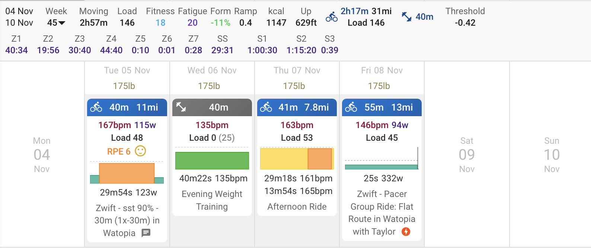

---

title: "Winter Arc"

date: 2024-11-11

description: "How many ways can we spin self-improvement?"

tags: [fitness]

---

# Winter Arc
The latest trend now is doing a "winter arc", which is basically just goal setting outside of the new years time frame. Goal setting can be a strong motivator, but it should not be solely focused on the outcome. [Shifting towards process-focused goals moves the goal-post to the closer to where we're at today, allowing for easy wins which translate to long term results.](https://www.strongerbyscience.com/goal-setting/#:~:text=The%20alternative%20is%20to%20take%20a%20process%2Doriented%20approach%2C%20in%20which%20we%20focus%20on%20the%20tasks%2C%20behaviors%2C%20and%20habits%20that%20should%20lead%20us%20toward%20our%20desired%20outcome%20rather%20than%20fixating%20on%20the%20outcome%20itself.)
## Goal
While some proponents of the "winter arc" shy away from telling others about their goals, I am using the term loosely and honestly ironically.

**Cycling**: Progress SST up to a single 90 minute interval. Translating this to a process-focused goal would then be cycling three days per week. Supporting goals for this includes strength-training two days per week.

## Why set goals in the first place?
Setting goals is great for making clear what you want to achieve. I've been cycling rather aimlessly for the past year, and want to shift towards performance because that's just what I like. The idea of improving my capabilities over time is what motivates me. 

When I'm feeling lost, focusing on my health (physical, mental, emotional, social) always helps in a way with realigning myself. That is not to say it cannot also throw me off my course. Flexibility is a double-edged sword, but within reason it can be extremely practical.

## Flexibility

My process goal focusing just on cycling three days per week is intentionally vague and loose. My current obligations often compete with my own personal goals, and that is true for many people. If I rigidly focus on getting those sessions in, disregarding school, work, or my relationships, I am doing myself a disservice. There will be weeks where I don't hit that three days goal, but that is expected and *perfection is not my aim.* 

### Nursing an injured hip
On the topic of flexibility, this left hip pain is not going away. It presents itself as a somewhat sharp 6-8/10 pain sporadically on the bike, or just standing up. I notice my internal rotation is somewhat lacking on that side, so I'm purposely working on progressing that, as well as strengthening my glutes.

## Week 1
- Cycling: 3 days, 2h17m total
- Weight training: 1 day

This was not an "ideal" week, but I was gone for the weekend camping so I give myself some lenience here. We did get one SST session going on Tuesday, which was better than expected. Looking forwards, week 2 will likely not be too difficult, due to my hip, but I am still looking to keep cycling. Consistency is key, and hopefully we will hear more about this.